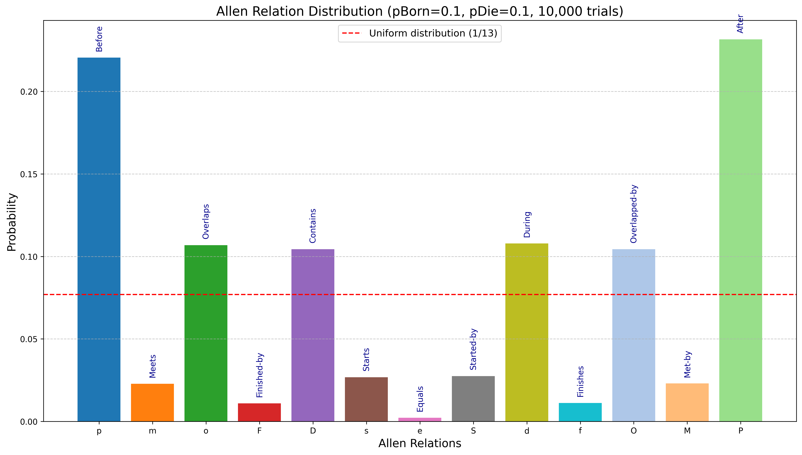
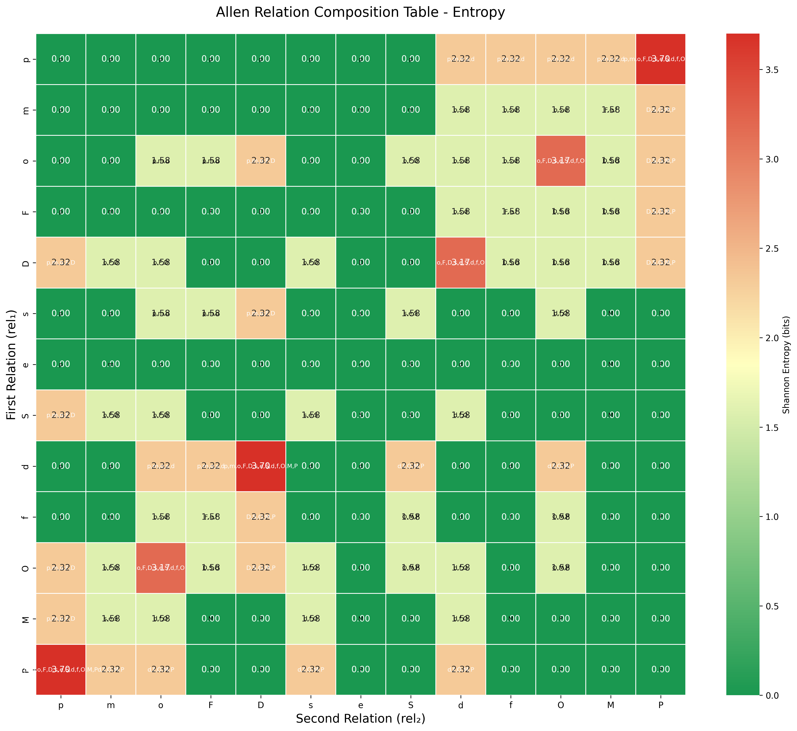
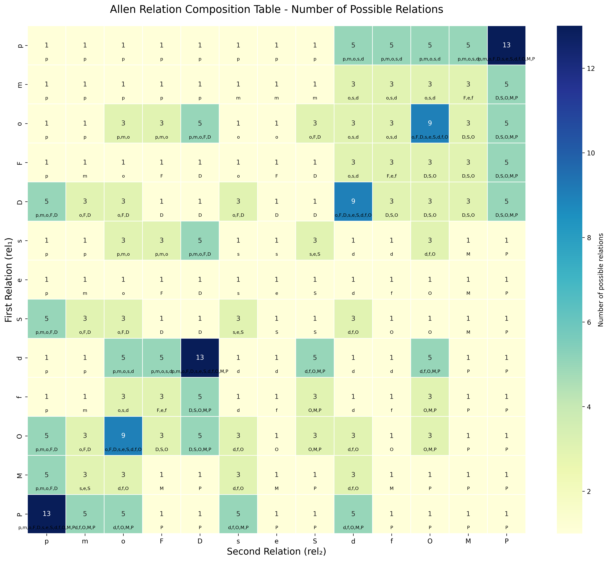

# Probabilities of Allen Interval Relations

Final Year Project — B.A. (Mod.) in Computer Science, Linguistics and a Language  
Trinity College Dublin

## Overview

James F. Allen’s Interval Algebra (1983) defines 13 distinct relations between time intervals (e.g., *before*, *meets*, *overlaps*, *during*, etc.), along with a composition table for transitive reasoning. However, **the original framework is deterministic** and does not incorporate **uncertainty**.

This project **extends Allen’s algebra with probabilistic modelling**, using **birth/death automata** to quantify how likely each relation is under different parameters (`p_Born`, `p_Die`). Through large-scale simulations, we observe that different relations arise at different frequencies — **refuting** the naive assumption of a uniform 1/13 distribution. Interactive Dash visualisations allow you to explore how these probabilities converge and how composition outcomes vary across parameter spaces.

### Why This Matters for LLMs

Recent research (e.g., *"Dissociating Language and Thought", 2024*) shows that Large Language Models (LLMs) excel at linguistic tasks but **struggle with rigorous temporal reasoning**. This project addresses that gap by **explicitly modelling** temporal intervals under uncertainty. While LLMs handle textual patterns, they often lack the structured, probabilistic logic seen here. This approach could serve as a foundation for complementary modules or hybrid integrations with LLMs.

---

## Key Features

1. **Complete Allen Interval Implementation**  
   - `relations.py` encodes all 13 base relations and supports composition/inversion via Alspaugh’s notation.

2. **Probabilistic Simulations**  
   - `simulations.py` uses birth–death automata with configurable `p_Born` and `p_Die`.  
   - Simulates how often each of Allen’s 13 relations emerges across thousands of trials.

3. **Statistical Analysis**  
   - Tools to test uniformity hypotheses (e.g., chi-square).  
   - Compare empirical frequencies with theoretical distributions (e.g., 1/9 vs. 1/27 classes).

4. **Interactive Dashboard**  
   - Launch with `app.py` to explore:
     - **Animated Distribution**: Watch relation frequencies converge over time.  
     - **Composition Heatmap**: Visualise sets like `(pmosd)` from the composition table.  
     - **Parameter Surface**: 3D plots showing how `p_Born` and `p_Die` affect distribution and entropy.

5. **Comparative Analysis**  
   - Analyse how different (`p`, `q`) settings influence the probability of *before*, *meets*, *overlaps*, etc.  
   - Explore extreme cases (e.g., `p → 0`, `q → 0`) to see which relations dominate.

---

## Example Visualisations

1. **Basic Distribution**  
   

2. **Composition Table Entropy**  
   

3. **Composition Table Size**  
   

These plots can be auto-generated or explored interactively via the dashboard.

---

## Project Structure

```
allen-interval-probabilities/
├── relations.py              # Core Allen relations (p, m, o, d, s, f, e, etc.)
├── simulations.py            # Birth/death automata simulation & stats
├── visualisations.py         # Basic matplotlib charts for distributions
├── advanced_visualisations.py # Additional or legacy visualisation scripts
├── animated_distribution.py  # Real-time distribution evolution with Dash
├── composition_heatmap.py    # Interactive composition table visualisation
├── parameter_surface.py      # 3D parameter surface (Plotly)
├── dashboard_integration.py  # Dash callbacks & data flow
├── dashboard_shell.py        # Base layout structure for the Dash app
├── app.py                    # Main application entry point
├── requirements.txt          # Required packages (NumPy, Plotly, etc.)
├── LICENSE                   # MIT Licence
└── README.md                 # You're reading it now
```

---

## Installation & Setup

**Prerequisites**:
- Python 3.7+
- `pip` package manager

**Steps**:
1. Clone the repository:
   ```bash
   git clone https://github.com/vxrdis/allen-interval-probabilities.git
   cd allen-interval-probabilities
   ```
2. (Optional) Create a virtual environment:
   ```bash
   python -m venv venv
   source venv/bin/activate  # or venv\Scripts\activate on Windows
   ```
3. Install dependencies:
   ```bash
   pip install -r requirements.txt
   ```

---

## Usage

### A. Running a Basic Simulation
```python
from simulations import IntervalSimulation

sim = IntervalSimulation(born_prob=0.1, die_prob=0.1)
results = sim.run_trials(10000)

# Distribution of Allen relations
distribution = results.get_distribution()
print("Relation Frequencies:", distribution)
```

### B. Hypothesis Testing
```python
from simulations import test_uniform_hypothesis

p_value = test_uniform_hypothesis(distribution)
print("P-value vs. uniform distribution:", p_value)
```
- If `p_value < 0.05`, you reject the uniform distribution hypothesis — indicating that some relations are significantly more frequent.

### C. Interactive Dashboard
```bash
python app.py
```
- Visit `http://127.0.0.1:8050/` in your browser to explore simulations, composition tables, and parameter sweeps.

---

## Key Findings

1. **Non-Uniform Relation Distribution**  
   Across different (`p_Born`, `p_Die`) settings, some relations (*before*, *meets*, *starts*) appear more frequently (~1/9), while others (*overlaps*, *during*) appear less (~1/27), disproving a 1/13 uniform assumption.

2. **Composition Outcomes**  
   Composition sets like `(pmosd)` show internal probability variation (e.g., *p, m, s* more likely than *o, d*). Formal tests compare empirical results with theoretical predictions.

3. **Parameter-Driven Patterns**  
   - As `p → 0` and `q → 0`, *before/after* relations dominate (~50%).  
   - Higher `p_Born` / `p_Die` values bring in more balanced distributions.  
   - Extreme cases help validate transitions predicted by random scheduling theory.

4. **Implications for LLMs**  
   LLMs lack structured temporal logic. This probabilistic interval model may inform better temporal reasoning modules or hybrid symbolic–neural systems.

---

## Deploying the Dashboard

- **Localhost**: Run `python app.py`
- **Render / Heroku**:
  - Link your GitHub repository.
  - Set build command: `pip install -r requirements.txt`
  - Set start command: `python app.py`
  - Define Python version in environment variables if needed.

---

## Ethical & Inclusivity Statement

- **No Human Data**: Only simulated intervals used; no personal or sensitive data involved.
- **Academic Integrity**: Code and references are properly cited.
- **Inclusivity**: Dashboard uses colour-blind-friendly palettes where possible.

---

## References

- **Allen, J. F. (1983)** — *Maintaining Knowledge about Temporal Intervals*, Communications of the ACM, 26(11), 832–843.  
- [Thomas Alspaugh’s Allen Algebra](https://thomasalspaugh.org/pub/fnd/allen.html)  
- **Fernando & Vogel (2019)** — *Prior Probabilities of Allen’s Interval Relations*  
- *Dissociating Language and Thought* (2024) — *Trends in Cognitive Sciences*  
- See code docstrings for additional references.

---

## Licence

This project is licensed under the MIT Licence. See [LICENSE](./LICENSE) for details.

---

*Feedback and contributions are welcome. Please open an issue or contact the repository maintainer.*
